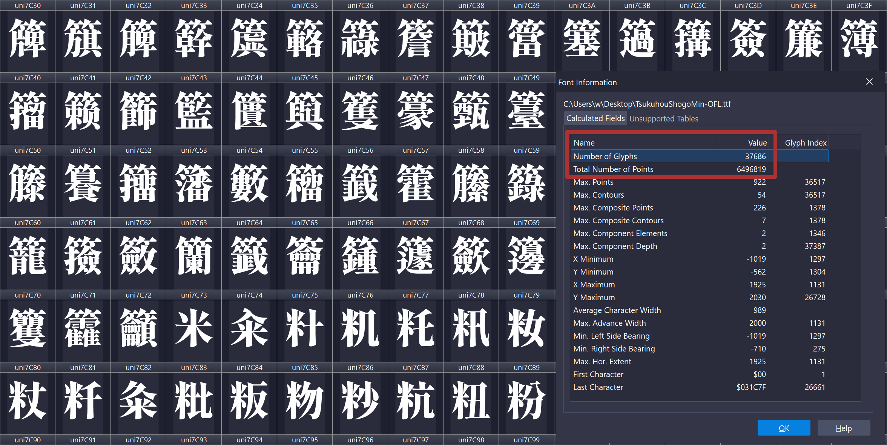



## Who is ~~Chara~~ Cvnka?

 Cvnka is a broadcaster who multistreams to [Twitch](https://www.twitch.tv/cvnka), [YouTube](https://www.youtube.com/cvnka), and [Kick](https://kick.com/cvnka).

Since Twitch now allows combining chats on stream, she started using a chat combo box, which is essentially just a browser source. The default appearance of the chat message bubbles wasn't matching the stream's style, so she got a design from an artist. I told Cv I could help with coding so I received a copy of the design file from her and started inspecting it. Keep reading to learn a couple OBS-specific tricks and optimizations to make your life easier as a streamer.

## Redesigning the chatbox

{}

### Design analysis

Opening the design file reveals a collage with a bunch of traditional designer's tricks. It's a singular multilayer raster (`.PSD`) file with comments.
At a glance it's mostly fine, the designer was too lazy to render every variant of the chat message, and didn't explicitly explain their "design system" (which is gonna bite me later, but I don't know it yet). I can work with that.


There are several things that are easy to design by hand but trickier to implement in CSS.  
The biggest issue is actually this line:

> BG Font: Tsukuhou Shogo Mincho

Why is it bad? It's just a font, right? Well, it's a `38.8 MB` TrueType font file. Not a font family -- a singular font with more than 37,000 glyphs in it.



### Font optimization

The fix is simple if you know what you're doing. For such "static" designs you don't need an entire source font, only a small number of glyphs from it. Looking at the design file, we only need _five_ of them for the chat box. I solved it by creating a custom, web-optimized version of the font which with almost `7,000` times smaller file size than the original font file. The designer forgot to specify the badges font (they used Oshidashi M Gothic). To further improve consistency we're gonna reuse the Tsukuhou font, and for the background glyph we will actually use a singular "hollow" svg shape.

Why would one even bother? Doing so helps reducing memory usage by OBS, and we _really_ want a crash-free streaming experience. Why make a font instead of extracting the glyph shapes in SVG? It doesn't matter too much in this particular case, but fonts aren't just a collection of symbols, there are also things like pairings and kerning, and SVG shapes don't know about these things. Imagine if you needed regular letters like `A` and `V` as well, you'd have to either separately export `AV` and `VA`, or manually adjust the spacing between the letters by hand, and we don't want to redo work already done by the font designer.


| Glyph | Index in the font file |
| :---: | ---------------------: |
|  地   |                   4658 |
|  球   |                  12006 |
|  者   |                  15071 |
|  読   |                  17790 |
|  購   |                  18379 |

The newly created font is exported in `Web Open Font Format 2.0`, which offers compression and can be loaded from CSS using the usual `@font-face`.
It takes `5.59 KB`, which is `6,940` times smaller. Neat!

### Styling override

The default bubble styling is clinically boring, we're gonna change that to make it look just like the source design.


I struggled a bit recreating the "beak" of the message bubble: the shapes' borders I was constructing the bubble from kept intersecting producing unpleasant results, so it took some time and experimentation.
Another thing I overlooked was combining subscriber and VIP/mod -- that's where the design file not having every permutation of the features bit me. To fix this I spent some time creating a preview page which compiles every single possible combination of the features, and kept checking that nothing broke when something changed. Ultimately it saved me time.
As a subtask we learned that stream scenes like gameplay needed a smaller, more compact chatbox with wider and less tall bubbles to keep chat visible but not as prominent, so I created a separate design override just for that. It works as an extra line of CSS import.

Mechanically, targeting these elements did the trick:

```CSS
/* background-color (#0C0D13) + background-image stack (corner triangle, glow, watermark) */
#messageContainer

/* role wash (mod grid / VIP radial / broadcaster mask / wuote green radial) */
.message-contents::before

/* text + emotes */
#message

/* role bar (sub diagonals / mod barcode / broadcaster bars) */
.message-contents::after

/* beak / acid drip */
#messageContainer::before

/* bottom-right role badge or arrow */
#messageContainer::after

/* the username tab and its ::after (VIP/wuote top decoration) */
#userInfo
```

Here's how my preview files look like:


### Improving streamer's experience


**Tip**  
You don't have to paste CSS file contents to the OBS browser source


To apply fixes done to CSS you need to replace the CSS in OBS browser's source. A better approach is to host the css file and just import it. All the changes automatically apply upon refreshing the source. Very smooth, very seamless.
I setup a private repository with Cloudflare integration. On push a static assets Cloudflare worker compiles and minifies CSS using esbuild, then puts the result into the `public` directory. All that is left to do is import the CSS file once and it always stays up to date.

```CSS
/* Main styling */
@import url("https://example.com/cvnka-multichat-overlay.css");
/* Style override for the gaming scene */
@import url("https://example.com/cvnka-compact.css");
```


{}

## The result


Hope some of this was helpful.
