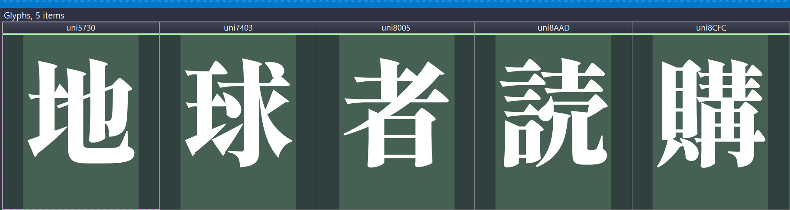



## Who is ~~Chara~~ Cvnka?

 Cvnka is a broadcaster who multistreams to [Twitch](https://www.twitch.tv/cvnka), [YouTube](https://www.youtube.com/cvnka), and [Kick](https://kick.com/cvnka).

Since Twitch now allows combining chats on stream, she started using a chat combo box, which is essentially just a browser source. The default appearance of the chat message bubbles wasn't matching the broadcast's style, so she got a design from an artist. I told Cv I could help with coding so I received a copy of the design file from her and started checking it. Keep reading to learn about a couple neat OBS-specific tricks and optimizations to make your life easier as a streamer.

{}

### Design analysis

Opening the design file reveals a collage with a bunch of tranditional designer's tricks: clip masks, copy, is a singular multilayer raster (`.PSD`) file with comments.
At a glance it's mostly fine, the designer was too lazy to render every variant of the chat message, and didnt explicitly explain their "design system", but I can work with that.

There are several things that are easy to design by hand but trickier to implement in CSS.  
The biggest issue is actually at this line:

> BG Font: Tsukuhou Shogo Mincho

Doesn't look too bad, it's just a font, right? Well, it's a `38.8 MB` font file. Not a font family, mind you,-- a singular font with more than 37,000 glyphs in it.

Looking at the design file, we only need _five_ of them for the chat box. I solved it by creating a custom, web-optimized version of the font which requires `6333` times less storage/memory than the original font file. Why would one even bother? Doing so helps reducing memory usage by OBS, and we _really_ want a crash-free streaming experience.

| Glyph | Index in the font file |
| :---: | ---------------------: |
|  地   |                   4658 |
|  球   |                  12006 |
|  者   |                  15071 |
|  読   |                  17790 |
|  購   |                  18379 |

### Converting raster drawings

{}

https://www.youtube.com/watch?v=zc3cbLncmp0

153

50 shipping

## Drawings

Here are the drawings of the tally controller:



 



## The Blogpost

## The Email

On Thu, Aug 19, 2021, I received the response:

> thanks for requesting the Lighthouse Software.
> A few things to note:
>
> - The source code is not free of charge and cannot been downloaded. Instead, we ship a USB stick with the Source code. It costs 25€ + Fright Charge
> - The source code is for personal use, only.
> - There is no technical support for the building process or for the resulting binary.

Adam Hall 4903 Rubber Feet https://www.adamhall.com/shop/en/feet-skids/4903

Neutrik NC3MD-S-1-B https://www.neutrik.com/en/product/nc3md-s-1-b

Neutrik NC5FD-LX https://www.neutrik.com/en/product/nc5fd-lx?c=audio

Canare L-4E6S https://www.canare.co.jp/en/products/cables/index.php?tid=4_001

Arduino UNO R4 WiFi https://store.arduino.cc/products/uno-r4-wifi

Arduino Motor Shield Rev3 https://store.arduino.cc/products/arduino-motor-shield-rev3

## Videos





---

##

Required Components and Parts

| #   | Part Name                                                                                                                   | Qty | Notes                                                                                            |
| --- | --------------------------------------------------------------------------------------------------------------------------- | --- | ------------------------------------------------------------------------------------------------ |
| 1   | [M3 8mm Hex Drive Flat Head Screw](https://www.mcmaster.com/90729A167/)                                                     | 4   |                                                                                                  |
| 2   | [18-8 Stainless Steel Washer](https://www.mcmaster.com/93475A210/)                                                          | 4   |                                                                                                  |
| 3   | [M3 x 0.5 mm Hex Nut](https://www.mcmaster.com/90591A250/)                                                                  | 4   |                                                                                                  |
| 4   | [Adam Hall 4903 Rubber Feet](https://www.adamhall.com/shop/en/feet-skids/4903)                                              | 4   |                                                                                                  |
| 5   | [Neutrik NC5FD-LX](https://www.neutrik.com/en/product/nc5fd-lx)                                                             | 1   |                                                                                                  |
| 6   | [Neutrik NC3MD-S-1-B](https://www.neutrik.com/en/product/nc3md-s-1-b)                                                       | 1   | Screw terminals make assembly easier compared to when using Neutrik NC3MD-L-B-1 with solder cups |
| 7   | [Canare L-4E6S](https://www.canare.co.jp/en/products/cables/index.php?tid=4_001)                                            | 1   | Minimum required length: 100mm, cut a 120-140mm piece before stripping the cable                 |
| 8   | [Arduino Motor Shield Rev3](https://store.arduino.cc/products/arduino-motor-shield-rev3)                                    | 1   |                                                                                                  |
| 9   | [Arduino UNO R4 WiFi](https://store.arduino.cc/products/uno-r4-wifi)                                                        | 1   | Arduino UNO R4 Minima works too, needs constant wired connection to the computer                 |
| 10  | [3D-printed enclosure with lid](<assets/3d printing model/Mic Tally Enclosure for Printing.3mf>)                            | 1   | Regular PLA works well                                                                           |
| 11  | [A 12V Power Adapter](https://www.dahuasecurity.com/products/All-Products/Accessories/Power/DC-Power-Adapter/PFM321-Series) | 1   | Any cheap adapter should suffice                                                                 |

---

## Designing for 3D printing

https://blog.rahix.de/design-for-3d-printing/

---

## Decisions I Made and Why

1. Using fillet instead of chamfer in Autodesk Fusion to process the outer corners results would have resulted in reduced printing time and "prettier"-looking box. made printing faster, but mixing visual features.  But as everything in Fusion, the order of operations matter, so using fillet first, and then chamfer fixes the issue. .
1. I opted to mount arduino on through-hole pins instead of using brass inserts and screws combo, or through-plastic threads. Screwing things down is more secure, but I've learned that brass inserts aren't ubiquitous, and some 3D printers' lack of "resolution" and precision characteristics don't allow printing threading connections of a small diameter. Self-tapping, flexible connection points, and other techniques often used in 3D printing are available. I might improve that part of the design in the future if I feel like it. Current design is good enough for a static box.
1. The lid does not firmy click in place. Again, the dovetail is good enough for a static box, but may be improved.

## Notes

TBA
