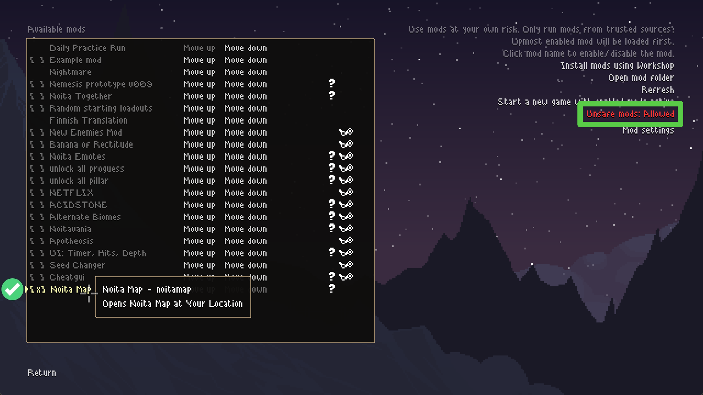
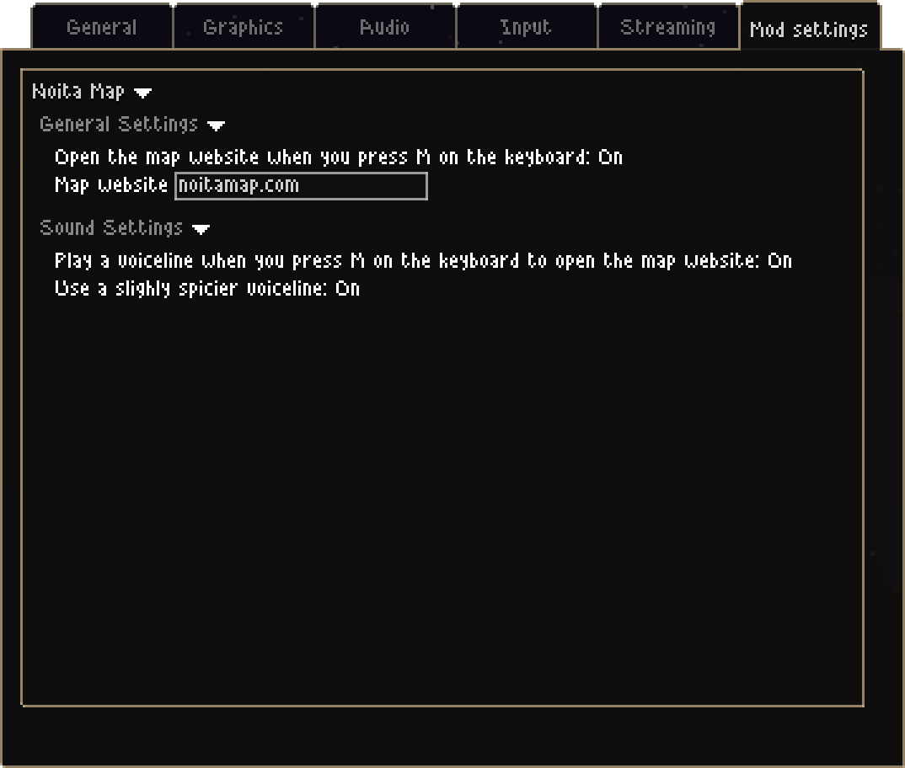


  Currently it is impossible to generate the map for the seed you are playing, so the map will stay the same, but the location will be precise.


## TLDR: Press `M` on your keyboard to open a new browser window with [NoitaMap](https://noitamap.com/) at your location in the game

<br>



{}

### Download

Download the latest release from [GitHub](https://github.com/acidflow-noita/noitamap-mod) using the button above.

### Install

Uncompress `noitamap.zip` and move the `noitamap` folder into the `mods` folder in Noita (Steam ➔ right click Noita ➔ Local files), or copy and paste the path into Windows Explorer:
```plaintext {filename="Noita Mods Location"}
C:\Program Files (x86)\Steam\steamapps\common\Noita\mods
```




















### Enable

Launch Noita, click "Mods", click "Unsafe mods: Disabled", click "Yes" (this is due to deeper game integration requirements), click on "Noita Map" in the mods list so it shows `[x]`.


### Extra step: Adjust Settings

Adjust mod settings to your liking: you can choose from one of the sounds, and even disable the map opening, that way you get a sound board.


### Enjoy!

Press `M` mid-run to open the map at your current location.

Have fun, run fast and throw hard!

{}
