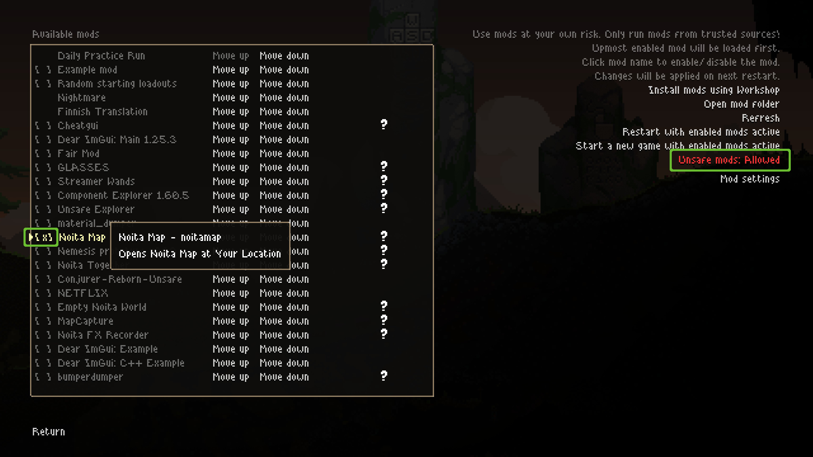
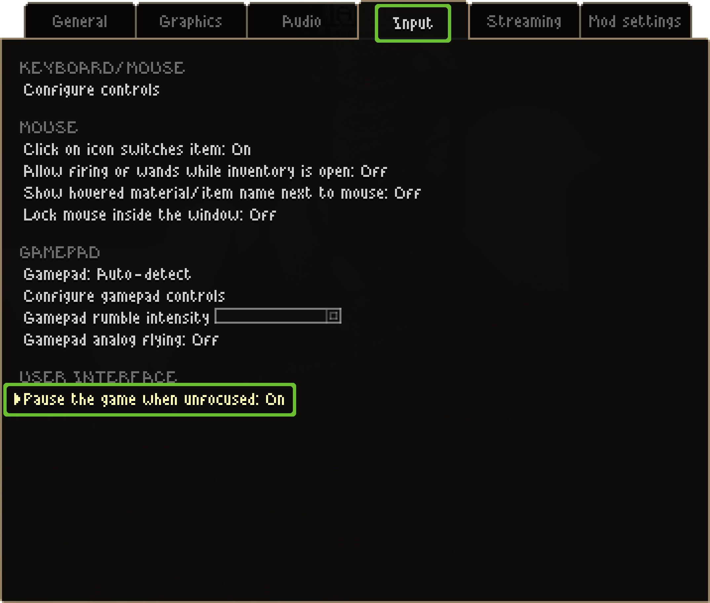
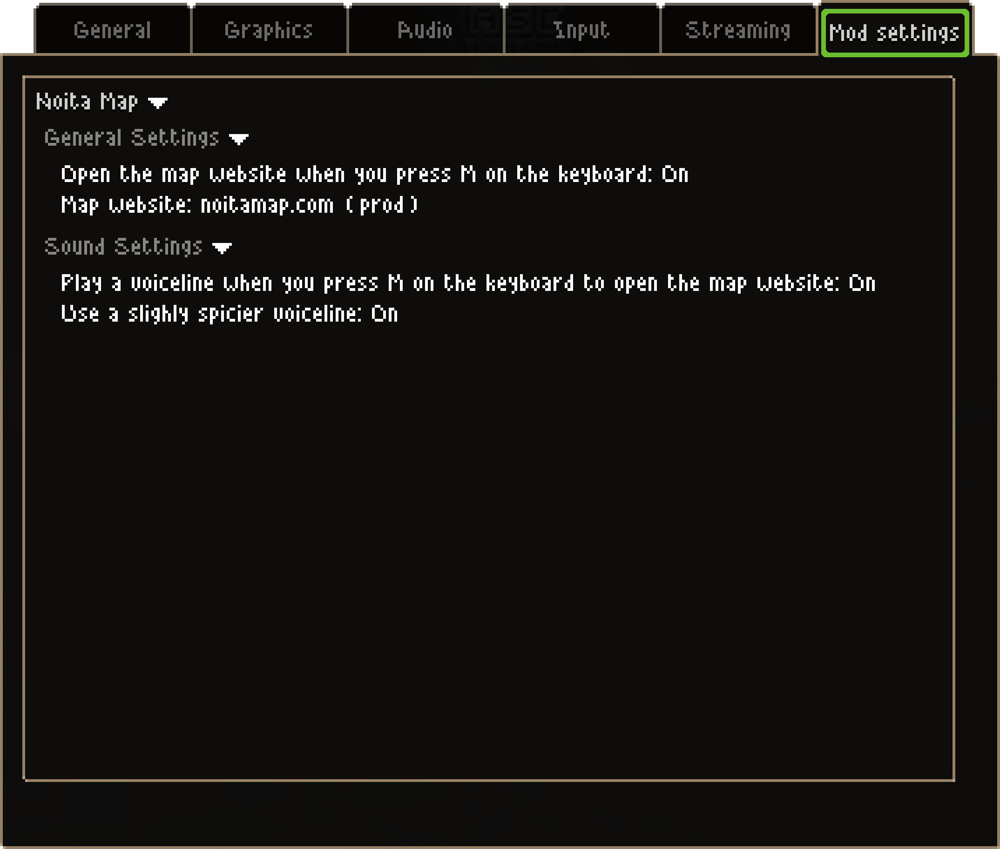


Press `M` key on your keyboard to open [NoitaMap](https://noitamap.com) with the map of your current run at your current location in the world.

The map knows about your progress (spell unlocks).

Daily run map generation is also supported!


## TLDR: Press `M` on your keyboard to open a new browser window with [NoitaMap](https://noitamap.com/) with the map of _your_ current run!

<br>



## How to use the mod

{}

### Download

Download the latest release from [GitHub](https://github.com/acidflow-noita/noitamap-mod) using the button above.

### Install

Uncompress `noitamap.zip` and move the `noitamap` folder into the `mods` folder in Noita (Steam ➔ right click Noita ➔ Local files), or copy and paste the path into Windows Explorer:

```plaintext {filename="Noita Mods Location"}
C:\Program Files (x86)\Steam\steamapps\common\Noita\mods
```




















### Enable

Launch Noita, click "Mods", click "Unsafe mods: Disabled", click "Yes" (this is due to deeper game integration requirements), click on "Noita Map" in the mods list so it shows `[x]`.


### (_optional_) Turn on "Pause the game when focused" option in the settings.



### Press `M` mid-run to open the map of your run!

### Extra step: adjust settings

Adjust mod settings to your liking: you can choose from one of the sounds, and even disable the map opening, that way you get a sound board.


{}

## FAQ

### When will you publish the mod on the Steam Workshop

I am unable to do so: NoitaMap mod requires elevated mod permissions (this is an "unsafe" mod). Unsafe mods are not allowed on the Workshop.

## Credits

Huge thanks to [Horscht](https://github.com/TheHorscht) and [Dexter](https://github.com/dextercd) for their help.
