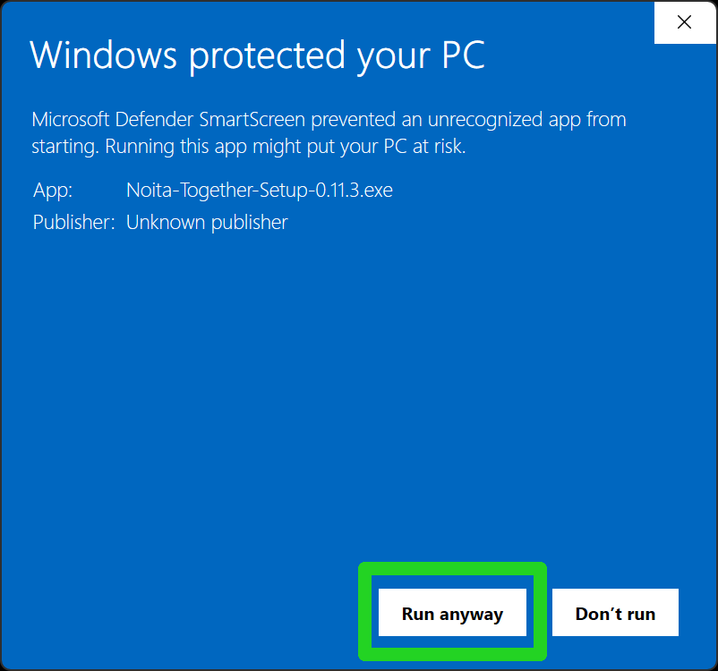

> Noita Together, or NT for short, is an attempt to bring a slight multiplayer aspect to the game, think of it more like everyone is in different dimensions yet you can still see other players and somewhat interact with each other you can not directly affect other player's worlds.

NT is an open source project hosted on  [GitHub](https://github.com/Noita-Together/noita-together/).

Download the latest builds from the repository:


 
 


## How to play

{}

### Download and Install NT

Use the buttons above to download NT installer. Launch it from the downloads. The installer will also automatically put NT into your game files where it should be for both Steam and GOG versions of Noita.
You will get Windows Defender warning saying that NT is an unrecognized app. The reason for that is that a root code-signing certificate, that Windows recognizes, costs about $1000 per year, and we cannot afford that. The NT client is open-source so anyone can check the code and verify that it isn't doing any nasty stuff.

### Open Noita and activate NT

Go to Mods menu and click "Enable unsafe mods" on the right, then "Yes", after that enable NT so it's marked active like this `[x]`.

### Launch NT Client

Upon the first launch it will automatically update and download all necessary files.

### Login with Twitch

Securely login with your Twitch account. This step requires you to be logged into Twitch in your browser. After login you can close the browser tab (it will tell you).

### Create or Join a Room

{}

Join a room by double-clicking on it in the list. If a room is password-protected (has a lock icon next to its name), you will need to enter it.

{}

{}

Create a room and set how many players maximum you want in your run. Partnered Twitch streamers get the option to host rooms up to 120 players.

Adjust Rules for the Run. Defaults are usually fine unless you want something very specific. Experiment with the buttons and learn what they do.

After everyone you wanted in the run joined and is ready press the "Start Run" button, good luck!

{}

### Start New Game

You need to start a new run **twice**. Starting a run synchronizes you with other players, so it kills you first, this is normal.

### You are Good to Go!

GLHF!

{}
